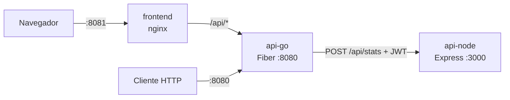

# Factorización QR y estadísticas

Solución compuesta por dos APIs REST y un frontend:

- **API en Go (Fiber):** recibe una matriz rectangular, calcula su
  factorización QR y envía Q y R a la API de Node.
- **API en Node.js (Express):** calcula estadísticas sobre las matrices
  recibidas: valor máximo, mínimo, promedio, suma total y si alguna es diagonal.
- **Frontend (HTML/CSS/JS + nginx):** permite iniciar sesión, ingresar una
  matriz y ver el resultado.

Las decisiones técnicas y sus alternativas están en [DECISIONES.md](DECISIONES.md).

## Arquitectura



1. El cliente inicia sesión en `POST /api/auth/login` y obtiene un JWT.
2. Envía la matriz a `POST /api/qr` con el token.
3. Go valida la matriz, calcula la QR (Householder) y reenvía Q y R a Node
   con el mismo token.
4. Node valida el token, calcula las estadísticas y responde.
5. Go devuelve Q, R y las estadísticas en una sola respuesta.

La API de Node es un **servicio interno**: en Docker no publica puertos y
solo es accesible desde la API de Go. Aun así valida el JWT (confianza cero).

> **Nota sobre el enunciado:** la sección de arquitectura menciona una
> "rotación" de la matriz, mientras que la funcionalidad requerida pide la
> factorización QR y la segunda API habla de "las matrices devueltas" (Q y R).
> Se implementó la factorización QR. Ver decisión 1 en DECISIONES.md.

## Requisitos

- [Docker Desktop](https://www.docker.com/products/docker-desktop/) (con Docker Compose)

Para ejecutar los tests o las APIs sin Docker: Go 1.22+ y Node.js 20+.

## Cómo ejecutar

1. Crea el archivo de configuración a partir de la plantilla:

```bash
   cp .env.example .env
```

2. Completa los valores de `.env`. Para generar un secreto seguro:

```bash
   node -e "console.log(require('crypto').randomBytes(48).toString('base64url'))"
```

3. Levanta todo:

```bash
   docker compose up --build
```

4. Abre **http://localhost:8081** e inicia sesión con el usuario y la
   contraseña definidos en `.env`.

| Servicio  | URL                    | Expuesto              |
|-----------|------------------------|-----------------------|
| Frontend  | http://localhost:8081  | Sí                    |
| API Go    | http://localhost:8080  | Sí                    |
| API Node  | http://api-node:3000   | No (solo red interna) |

### Variables de entorno

| Variable        | Usada por | Descripción                                        |
|-----------------|-----------|----------------------------------------------------|
| `JWT_SECRET`    | Go, Node  | Secreto compartido para firmar JWT (mín. 32 caracteres) |
| `AUTH_USERNAME` | Go        | Usuario de demostración                            |
| `AUTH_PASSWORD` | Go        | Contraseña de demostración                         |
| `STATS_API_URL` | Go        | URL de la API de Node (definida en docker-compose) |

Si falta `JWT_SECRET` o tiene menos de 32 caracteres, las APIs no arrancan.

## Endpoints

### API Go

| Método | Ruta              | Auth | Descripción                         |
|--------|-------------------|------|-------------------------------------|
| GET    | `/health`         | No   | Estado del servicio                 |
| POST   | `/api/auth/login` | No   | Devuelve un JWT válido por 1 hora   |
| POST   | `/api/qr`         | JWT  | Factorización QR + estadísticas     |

**Login**

```http
POST /api/auth/login
Content-Type: application/json

{"username": "admin", "password": "..."}
```

```json
{"token": "eyJhbGciOiJIUzI1NiIs...", "expiresIn": 3600}
```

**Factorización QR**

```http
POST /api/qr
Content-Type: application/json
Authorization: Bearer <token>

{"matrix": [[12, -51, 4], [6, 167, -68], [-4, 24, -41]]}
```

```json
{
  "q": [[0.857, -0.394, -0.331], [0.429, 0.903, 0.034], [-0.286, 0.171, -0.943]],
  "r": [[14, 21, -14], [0, 175, -70], [0, 0, 35]],
  "stats": {
    "max": 175, "min": -70, "average": 8.97, "sum": 161.44, "count": 18,
    "anyDiagonal": false, "diagonalByMatrix": [false, false]
  }
}
```

(Valores redondeados en este ejemplo; la API devuelve precisión completa.)

### API Node (interna)

| Método | Ruta         | Auth | Descripción                                   |
|--------|--------------|------|-----------------------------------------------|
| GET    | `/health`    | No   | Estado del servicio                           |
| POST   | `/api/stats` | JWT  | Estadísticas de `{"matrices": [[[...]], ...]}` |

### Códigos de error

| Código | Significado                                                    |
|--------|----------------------------------------------------------------|
| 400    | JSON inválido o matriz mal formada (vacía, filas irregulares, valores no numéricos, mayor a 100×100) |
| 401    | Token ausente, inválido o expirado; o credenciales incorrectas |
| 502    | La API de Node no respondió o falló                            |

Todos los errores responden `{"error": "mensaje descriptivo"}`.

Los archivos `api-go/requests.http` y `api-node/requests.http` contienen
peticiones listas para ejecutar con la extensión REST Client de VS Code.

## Tests

```bash
# API Go: tests unitarios de la factorización QR y validaciones
cd api-go
go test ./... -v

# API Node: tests unitarios y de integración (incluye seguridad JWT)
cd api-node
npm install
npm test
```

Los tests de Go verifican las propiedades matemáticas de la QR
(A = Q·R, QᵀQ = I, R triangular superior) sobre matrices cuadradas,
rectangulares, diagonales y con columnas nulas.

## Estructura del proyecto

```
reto-interseguro/
├── api-go/
│   ├── main.go                  # Arranque, rutas y configuración
│   └── internal/
│       ├── auth/                # Emisión y validación de JWT
│       ├── client/              # Cliente HTTP hacia la API de Node
│       ├── handlers/            # Endpoints HTTP
│       └── matrix/              # Validación y factorización QR (+ tests)
├── api-node/
│   ├── src/
│   │   ├── app.js               # Configuración de Express
│   │   ├── auth.js              # Middleware JWT
│   │   ├── server.js            # Arranque
│   │   └── stats.js             # Validación y estadísticas
│   └── test/                    # Tests unitarios e integración
├── frontend/                    # HTML, CSS, JS y configuración de nginx
├── docker-compose.yml
├── .env.example
├── DECISIONES.md
└── README.md
```

## Despliegue en la nube

No incluido en esta entrega. Las imágenes de Docker están listas para
desplegarse; la propuesta es **Azure Container Apps**, que permite
reproducir el mismo diseño: API Go y frontend con ingreso externo, y API
Node con ingreso solo interno, con los secretos gestionados como
secretos de la plataforma en lugar de un archivo `.env`.